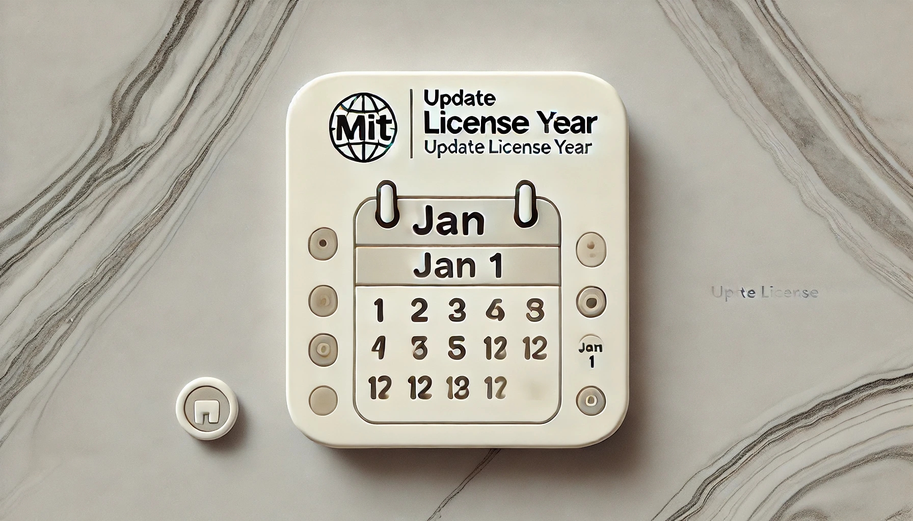

<p align="center">
  <a href=">
    
  </a>
</p>

<p align="center">
  <i>This repository is a repository that can be referenced and used from multiple repositories by placing common configuration files for Renovate, a dependency update tool, in one place.</i>
</p>

---

# Usage

```yaml
name: Update License Year

on:
  schedule:
    - cron: '0 0 1 1 *' # Run every January 1st
  workflow_dispatch:

jobs:
  commit-changes:
    runs-on: ubuntu-latest
    timeout-minutes: 5
    permissions:
      contents: write # Required to git push
    steps:
      - uses: actions/checkout@v4

      - name: Generate GitHub App Token
        id: app_token
        uses: actions/create-github-app-token@v1
        with:
          app-id: ${{ secrets.GHA_APP_ID }}
          private-key: ${{ secrets.GHA_APP_PRIVATE_KEY }}
          owner: ${{ github.repository_owner }}

      - uses: tqer39/update-license-year@v0.0.1-alpha
        with:
          github-token: ${{ steps.app_token.outputs.token }}
```

# inputs

## `github-token`

1. **Required** GitHub token. You need to use a GitHub App token, not `secrets

## Contributing

1. Fork the repository.
2. Create a new branch.
3. Make changes and commit.
4. Create a pull request.

## License

This project is licensed under the [MIT](LICENSE) license.
